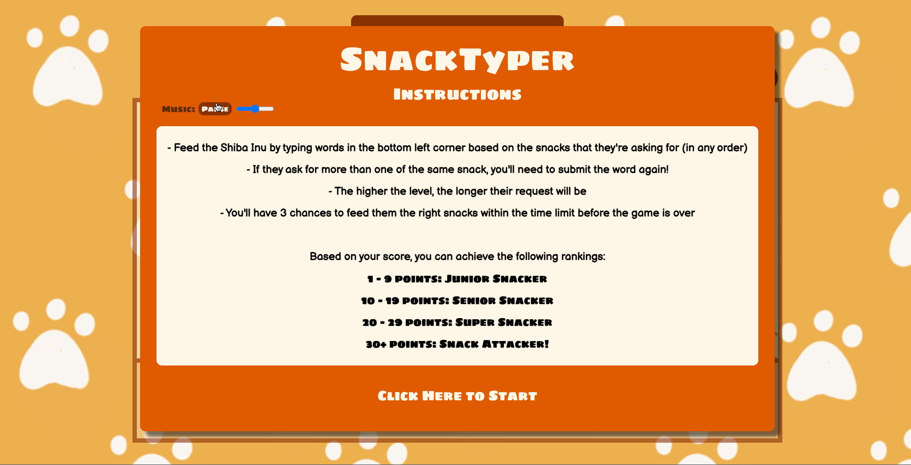
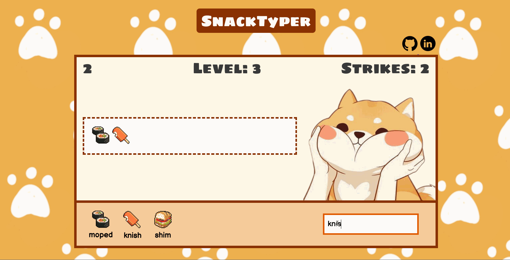
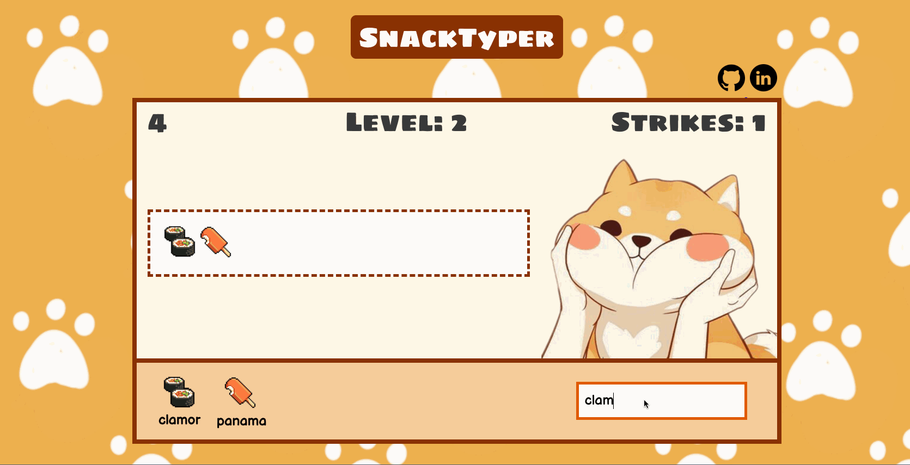

# <a href="https://stella-kang.github.io/SnackTyper/">SnackTyper</a>


[SnackTyper](https://stella-kang.github.io/SnackTyper/) is an snack-themed typing game where the player must feed the Shiba Inu within the alloted time by typing words that match the snacks that are shown on the screen. As the player progresses through the game, the amount of snacks requested will increase. The game will end when a user is unsuccessful in feeding the Shiba Inu (by running out of time) three times.

## Technologies Used
SnackTyper was implemented using vanilla Javascript and CSS3.

## Key Features

### Splash and Gameplay
When the game loads, users are greeted with a splash page with instructions on how to play the game. The splash also includes a music player with an adjustable volume feature, which is defaulted to be paused. Users have the option of having background music while playing the game. Users will input words based on the requested snacks and the key provided. If the user inputs a match, then the snack associated with the word will be removed from the request area. The user will pass the level once all of the snacks have been removed.

```
    addListenerForInput() {
        const input = document.querySelector("#input-form")
        let eventCallback = (e) => {
            e.preventDefault();
            let val = e.target.elements.value.value

            if (this.inputs.checkInput(val)) {
                this.snacks.keys.forEach(el => {
                    if (el[1] === val) {
                        let li = document.querySelector(`#${el[0]}`)
                        li.remove();
                    }
                })
            } else {
                const input = document.querySelector("#string-input");
                input.classList.add("animation");
                setTimeout(() => {
                    input.classList.remove("animation")
                }, 500);
            };

            document.querySelector("#string-input").value = '';

            if (this.level.won()) {
                clearTimeout(this.eventTimer);
                this.nextLevel();
            }
        }

        this.inputEventCallback = eventCallback.bind(this);
        input.addEventListener("submit", this.inputEventCallback)
    }
```



### Game Over and Ranking
Users will receive a point to their score after they've successfully passed a level. Once the user has accumulated three strikes by running out of time on three levels, the game over splash will appear. The game over splash will show the user's score, as well as their ranking based on their score. It will also host a button that users can click to play again



### Animations
The Shiba Inu will animate when a user has not passed a level, indicating the incursion of a strike. Similarly, the input field will animate if a user has submitted a word that does not successfully remove a snack from the request field.



## Music
bedtime after a coffee by Barradeen | https://soundcloud.com/barradeen/ <br />
Creative Commons Attribution-ShareAlike 3.0 Unported <br />
https://creativecommons.org/licenses/by-sa/3.0/deed.en_US <br />
Music promoted by https://www.chosic.com/free-music/all/ <br />
