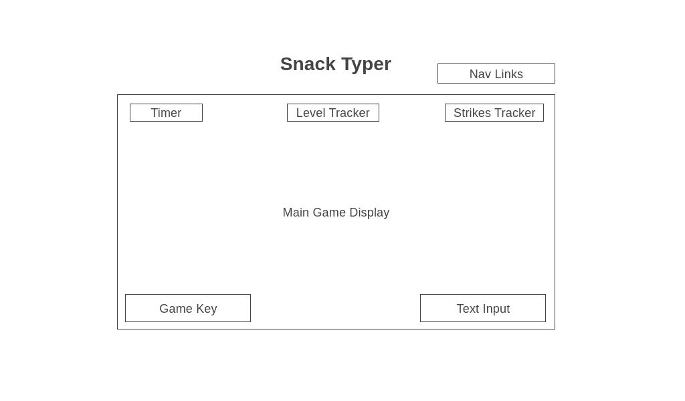

# SnackTyper

## <a href="https://stella-kang.github.io/Javascript-Project/">Game Page</a>

## Background
**SnackTyper** is an snack-themed typing game where the player must feed the Shiba Inu in the alloted time by typing the words that match what is shown on the screen, based on the key provided. As the player progresses through the game, the amount of snacks requested will increase. The game will end when a user is unsuccessful in feeding the animal (by running out of time) more than three times.

## Functionality and MVPs
In **SnackTyper**, users will be able to:
- Start and reset the game
- Use the keyboard to input words
- Track their score based on the amount of levels passed
- Track the amount of chances they have left before losing the game

In addition, the project will include:
- An instructions view that describes the rules of the game
- A production README

## Wireframes

    </img>

- Nav Links will include a link to the project's Github repo, as well as a link to my LinkedIn profile
- Level tracker will display a live tracker indicating how many levels the player has passed
- Strike tracker will display a live tracker indicating how many times the player has failed a level
- The Main Game Display will render the Shiba Inu, along with images of the snacks that must be matched for each level
- The Game Key will render all of the unique sacks for the level, and their corresponding words
- Text Input will be where the player is able to type the input for the main game functionality

## Technologies, Libraries, and APIs
This project will be implemeneted with the following technologies:
- Webpack to bundle and transpile the source Javascript code
- npm to manage project dependencies

## Implementation Timeline
- **Friday Afternoon & Weekend**: Build the skeleton of the project and render a functioning text input box that will correctly confirm if a word is included in a provided array. Become more familiar with the HTML structure for CSS formatting. Create a Game, Snacks, Input and Level class.
- **Monday**: Focus on perfecting the logic of the game -- ensuring that words are correctly rendered with their corresponding snack and inputs are matched accordingly. Also, create accurate tracking of strikes and levels, as well as an underlying timer. Increase the difficulty of the game after each level, as well.
- **Tuesday**: Reformat the game to implement desired styling, and ensure that all images for the animal and snacks are appropriately rendering.
- **Wednesday**: Finalize underlying logic and controls.
- **Thursday Morning**: Make any final touchups and update the README if necessary.

## Bonus Features
Some anticipated updates include:
- Allowing the player to choose the animal that they would like to feed
- Increase the timer for higher-level rounds for allow for elongated playability
- Adding optional background music, with the ability to pause/play and adjust volume

## Music
bedtime after a coffee by Barradeen | https://soundcloud.com/barradeen/  
Creative Commons Attribution-ShareAlike 3.0 Unported  
https://creativecommons.org/licenses/by-sa/3.0/deed.en_US  
Music promoted by https://www.chosic.com/free-music/all/  